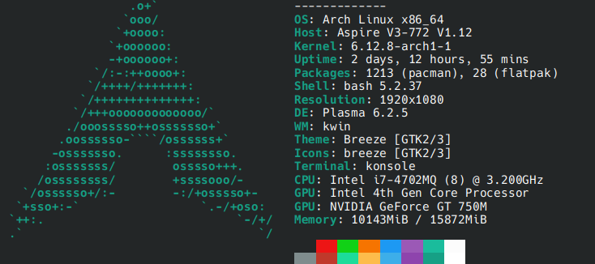
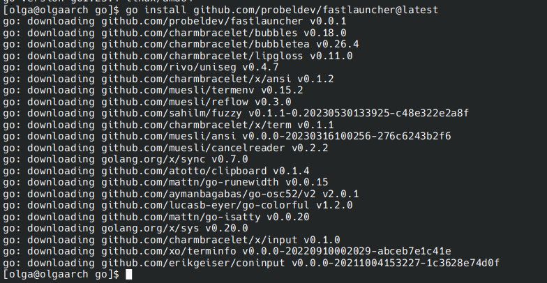
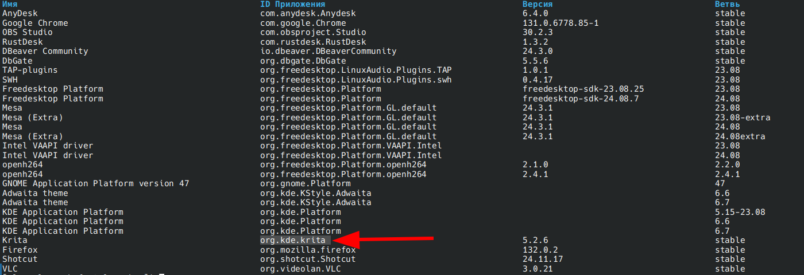
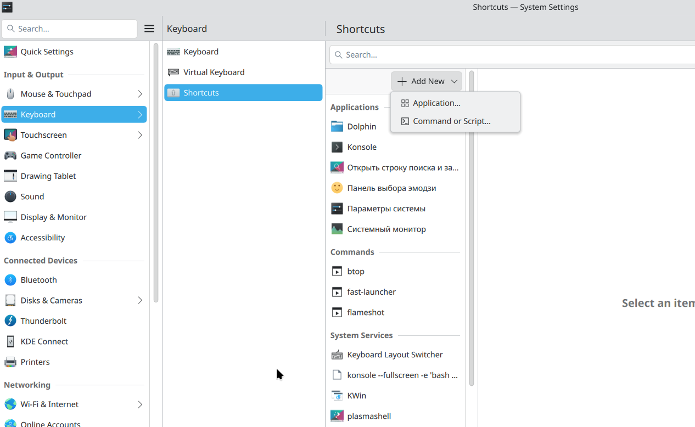
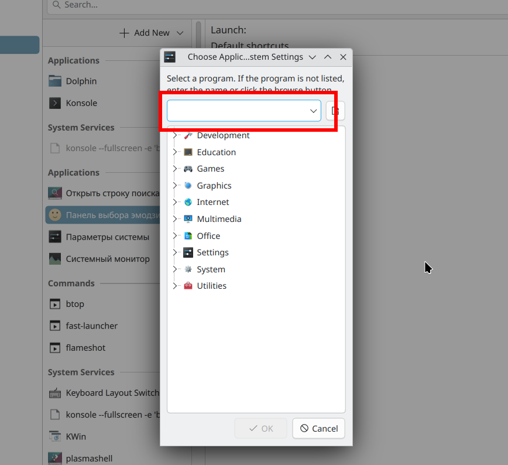
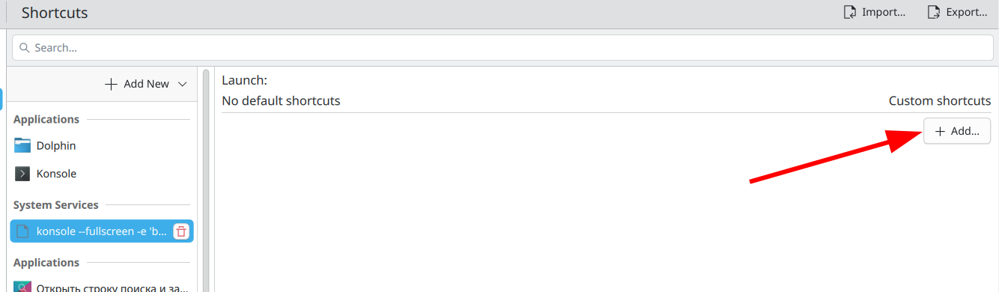
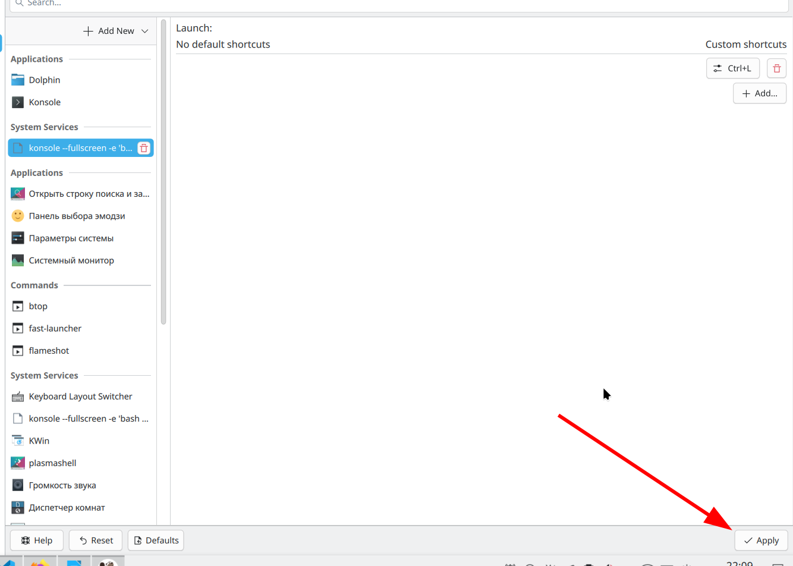

## Installation for Arch KDE

System parameters

<div align="center">



</div>

<!-- **Video installation guide is available [here](link)** -->

1. Install Golang. Open the terminal (Konsole) and insert the following command:

    ```bash
    sudo pacman -S go
    ```
    Check if it's installed: 
    ```
    go version
    ```

    If's Ok, you'll see:
      `go version go1.23.4 linux/amd64`


2. Install the launcher

    ```
    go install github.com/probeldev/fastlauncher@latest
    ```

    <div align="center">

    

    </div>

3. Creating Your Configuration File

    1. Create a new folder on your computer called `fast-launcher`  
    For example:

        ```bash
        mkdir -p ~/scripts/fast-launcher
        ```
    2. Inside this folder, create a new text file named `fast-launcher`
    
        ```bash
        touch cfg.json
        ```

    3. Open file

        ```bash
        nano ~/script/fast-launcher/cfg.json
        ```
    3. Copy and paste this template into the file:


        ```
            [

            {
                "title": "PROGRAM_NAME",
                "description": "DESCRIPTION",
                "command": "CALLING_COMMAND"
            },

            {
                "title": "Krita",
                "description": "Digital painting",
                "command": "flatpak run org.kde.krita"
            },

            {
                "title": "Kate",
                "description": "text editor",
                "command": "kate"
            }

            ]

        ```
        - Replace PROGRAM_NAME with the program name
        - Replace DESCRIPTION with your own description program
        - Replace CALLING_COMMAND with command that used to call the program

            If the program is installed with Flatpak, use this template `flatpak run APPLICATION_ID`.

             Find APPLICATION_ID this way:
            
            ```
            flatpak list
            ```

            APPLICATION_ID is in the second column

    <div align="center">

    

    </div>

    
## USAGE

 ### with shortcuts

Add Shorcuts to call the launcher

<div align="center">



</div>

1. System settings -> Keyboard -> Shortcuts -> Add New -> Application...

2. Enter the following in the field and save:

```
konsole --fullscreen -e 'bash -c  "~/go/bin/fastlauncher --config ~/script/fast-launcher/cfg.json" '
```
<div align="center">



</div>

3. Add shortcuts and apply:

<div align="center">



</div>

<div align="center">



</div>

### with terminal

1. Open the terminal


```bash
echo "export PATH=\$PATH:~/go/bin" >> ~/.bashrc
```

2. Close and reopen the terminal


```bash
fastlauncher --config ~/script/fast-launcher/cfg.json
```


If you get an error `deserialization json`, repeat step 3. `Creating Your Configuration File` 

## Unistallation

```
rm ~/go/bin/fastlauncher
```
